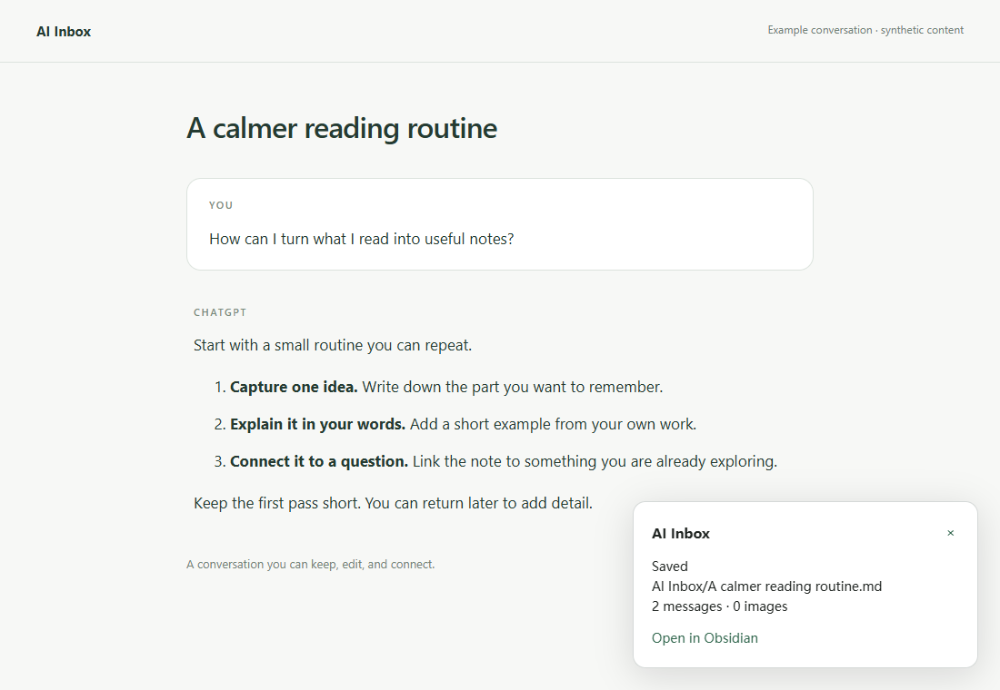

<h1 align="center">AI Inbox for your browser</h1>

<strong>One click, from ChatGPT to Obsidian.</strong>

Save the current conversation and its images from Chrome or Microsoft Edge.

English · <a href="README.zh-CN.md">简体中文</a> <a href="#features">Features</a> · <a href="#install">Install</a> · <a href="https://github.com/elfmedy/obsidian-ai-inbox">Obsidian plugin</a>

## Features

- **One click to save.** Capture all messages on the current ChatGPT conversation branch.
- **Bring images and references.** Download images and convert supported citations to readable links.
- **Find your vault.** Discover running Obsidian vaults, confirm the first connection, and remember your default.
- **Know what happened.** See progress and the final save result on the page.
- **Chrome and Edge.** Install the same unpacked extension package in either browser.

## Install

Requires the **[AI Inbox Obsidian plugin](https://github.com/elfmedy/obsidian-ai-inbox#install)** on the same computer. Keep Obsidian open when saving. Currently Alpha; distributed as an unpacked extension, not through either browser's store.

1. Install and enable the Obsidian plugin through BRAT: `elfmedy/obsidian-ai-inbox`.
2. Download **`ai-inbox-browser-0.4.0.zip`** from the [latest release](https://github.com/elfmedy/browser-ai-inbox/releases/latest). Do not use GitHub's **Source code** ZIP.
3. Extract it to a permanent folder. The extracted **`ai-inbox-browser`** folder contains `manifest.json`.
4. Open your browser's extensions page and turn on **Developer mode**:

   | Browser | Extensions page |
   | --- | --- |
   | Chrome | `chrome://extensions` |
   | Microsoft Edge | `edge://extensions` |

5. Click **Load unpacked** and select the **`ai-inbox-browser`** folder. Pin AI Inbox to the toolbar for easy access.

Keep this folder after installation: the browser loads the extension from it. Chrome 120+ / a current Chromium-based Edge desktop release are required. Firefox and Safari are not supported.

## Start saving

Open an ordinary ChatGPT conversation, wait until the reply finishes, and click **AI Inbox**. Approve the first connection in Obsidian. If more than one vault is running, choose a destination; it becomes the default.

Right-click the icon to switch vaults or open settings. Note formatting, thinking summaries, and attachment placement are configured in Obsidian. See the [guide](docs/guide.md) for details and troubleshooting.

## Update

1. Download and extract the new extension ZIP.
2. Copy the files **inside** its `ai-inbox-browser` folder into your **existing extension folder**, replacing matching files.
3. Click **Reload** on the extensions page, then refresh ChatGPT.

Unpacked extensions need manual updates. Keep the original loaded directory and avoid removing/reinstalling the extension to retain browser-local preferences and pairing. Users upgrading from the old `ai-inbox-chrome` package can keep that folder name and copy the new files into it.

Version **0.4.0** works with Obsidian AI Inbox **0.3.0+**. The projects now release independently; this update does not require an Obsidian update. Chrome and Edge have separate extension storage and each needs its own first connection.

---

[Report an issue](https://github.com/elfmedy/browser-ai-inbox/issues) · [Releases](https://github.com/elfmedy/browser-ai-inbox/releases) · [Build from source](CONTRIBUTING.md) · [MIT license](LICENSE)
